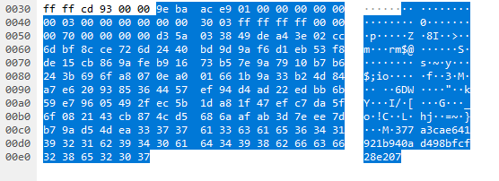
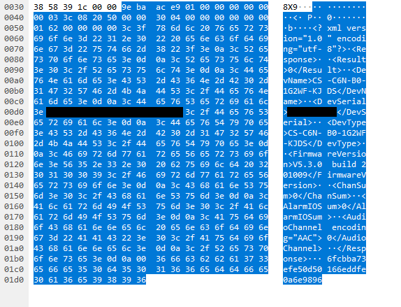

# Ezviz CS-C6N Camera Vulnerability

### Authentication Bypass & Information Exposure of Camera Services 

Nov 2023 - Joern

### 1. Abstract

This report provides details on the vulnerability based on CVE-Record **CVE-2023-48121** affecting some Ezviz cameras. The Ezviz CS-C6N camera hosts a service on TCP port 9010 which is used to control the camera directly via the mobile phone app bypassing the Ezviz cloud. The service implements various functionalities such as streaming live video, capture&send JPEG images and provide device information. By default, communication requests from the mobile phone app to the camera are AES encrypted with a pre-shared key. However, there is no enforcement in applying the cryptographic algorithm, so that cleartext requests are processed as well. Hence, the authentication scheme via pre-shared keys of the AES encryption can be bypassed which allows an attacker to consume the offered functionalities from an Ezviz CS-C6N camera without possessing any credentials. This vulnerability can be abused by an attacker with access to the network to which the camera is connected. This behavior was sucessfully demonstrated with two different PoCs (Device Info Provision and Live Image Capture). To mitigate this threat an user authentication scheme should be enforced for all serviced commands offered on TCP port 9010. Additionally the encryption of command server responses should be implemented as mandatory to prevent Man-in-the-Middle attacks.

Relevant CWEs:

- **CWE-288: Authentication Bypass Using an Alternate Path or Channel**
- **CWE-200: Exposure of Sensitive Information to an Unauthorized Actor**

The following description of the vulnerability will mainly focus on the device information request & response communication as to not expose too much information on how to retrieve camera images without authentication.

All information was shared within a responsible disclosure process with the Ezviz Security Team.

### 2. Device under Test

The research has been conducted with following device:
- **Ezviz CS-C6N-B0-1G2WF** 

	- *Firmware Version: V5.3.0 build 201009*
	- *Firmware Version: V5.3.0 build 210731*
	- *Firmware Version: V5.3.0 build 230215*
	
### 3. Affected devices

- Ezviz CS-C6N-xxx prior to v5.3.x build 20230401
- Ezviz CS-CV310-xxx prior to v5.3.x build 20230401
- Ezviz CS-C6CN-xxx prior to v5.3.x build 20230401
- Ezviz CS-C3N-xxx prior to v5.3.x build 20230401

### 4. General Vulnerability Description

The communication between the Ezviz mobile phone app and an Ezviz CS-C6N camera is realized via a proprietary protocol on TCP port 9010 (Ezviz Command Port) to remotely control the camera. A couple of different functionalities are implemented which provide the user with an interface to retrieve device information, live image captures and live video streams amongst others. Requests of the mobile phone app towards the camera are encrypted in regular operation mode. The request for retrieving the device information is shown as an example:

>

The message header itself is not encrypted and contains meta information including a command id and a message body encryption flag. The command id determines which functionality shall be accessed where as the message body itself contains further attributes for processing the request correctly. If the encryption flag in the header is set, the message body is assumed to be encrypted and a routine will decrypt it with the AES cryptographic algorithm (128bit) using a pre-shared key. This pre-shared key seems to be a device individual key which changes after a restart. A MD5 hash value is appended to the message payload regardless of the encryption flag and it will be checked in the message parsing process to ensure the message integrity.

Decrypting the message body reveals a XML structure:

>

Since the encryption of the message body with the pre-shared key is not enforced, an attacker could craft a cleartext request without any authentication and therefore is provided with a valid response. The server response of the device information request is not encrypted and contains the device information in cleartext:

>

### 5. Further analysis for live image extraction 

The same communication scheme also applies for the image capture function. The image capture function itself does offer an additional encryption layer option for the response to keep the image information confidential. However, the encryption of the image is not enforced and can be controlled by an XML attribute in the request message body.
Since the the attacker has full control over the request message, the image information can be retrieved as cleartext in JPEG format via the image capture function and therefore is vulnerable to the exposure of sensitive information. The presence of the JPEG magic number (FF D8 FF DB) in the response message already indicates that encryption is not in use: 

>

The attack does not require any secret information and can be conducted easily when the camera is reachable by the attacker via a network connection. 

### 6. Further affected functions

PoCs for these two functionalities demonstrate that the device info and live image extraction can be abused by attackers without any authentication. Due to user privacy the PoCs will not be made available to the public. However, the camera hosts further functionalities which might be prone to exploitation but will need further investigation:
- Streaming of live video via a proprietary Hikvision protocol (additional encryption layer on video payload activated by default)
- Streaming of locally saved video files (from SD card)
- Activation of picture mirroring
- Manipulation of pan and tilt of the camera 
- Activation of talk function and provide audio feed to camera
- Manipulation of OSD date

### 7. Additional Insights

In regular operation mode the pre-shared key is device individual and seems to offer an adequate level of security. Further information on the generation,exchange and storage of this pre-shared key would be needed to properly assess this security measure since the communication security is solely based on the secrecy of this key. Besides the pre-shared key implementation there seems to be some sort of legacy code which decrypts the incoming payload based on hardcoded keys. The details of this alternative operation mode have not been further investigated. According to Ezviz Security Team the legacy code with the hardcoded keys is deprecated and cannot be accessed with the currently implemented program logic. 

### 8. Vulnerability Remediation

A mandatory authentication scheme should be put in place to mitigate unauthorized exposure of camera image capture function as well as the usage of all other functionalities on TCP port 9010. The mechanisms of the generation of the pre-shared AES keys, their renewal cycle and their exchange between mobile phone app and camera have not been examined. Hence, without further information a final conclusion cannot be drawn whether the authentication mechanism via this pre-shared keys approach is sufficient or not.
Furthermore the encryption of all responses from the camera server should be enforced to prevent Man-in-the-Middle attacks.

### 9. Responsible Disclosure

All information on the vulnerability including two PoCs was shared in a responsible disclosure process with the Ezviz Security team. The prompt e-mail responses, professional incident handling is much appreciated and shows that Ezviz is taking customer security serious.  In coordination with the Ezviz Security Team it has been agreed that the PoCs will not be made available to the public to ensure customer privacy. 

**Timeline:**
- 2023-03-27: Initial Contact
- 2023-03-28: Response of Ezviz Security Team
- 2023-03-28: Provision of Report & PoC via encrypted email
- 2023-05-09: Issue confirmed by Ezviz Security Team and draft plan for remediation 
- 2023-09-18: Affected devices identified and fix implemented in code base
- 2023-09-27: Provision of draft version of public report
- 2023-10-11: Exchange of details on fix
- 2023-11-08: Application for CVE-ID
- 2023-11-23: Release of Security Notice by Ezviz
- 2023-11-23: Release of public report on Github

### 10. Further References

- CVE Record (CVE-2023-48121): [https://cve.mitre.org/cgi-bin/cvename.cgi?name=CVE-2023-48121](https://cve.mitre.org/cgi-bin/cvename.cgi?name=CVE-2023-48121)
- Ezviz Security Notice: [https://www.ezviz.com/data-security/security-notice/detail/911](https://www.ezviz.com/data-security/security-notice/detail/911)

